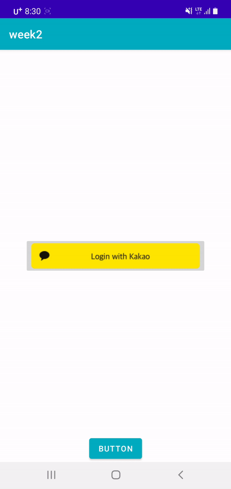
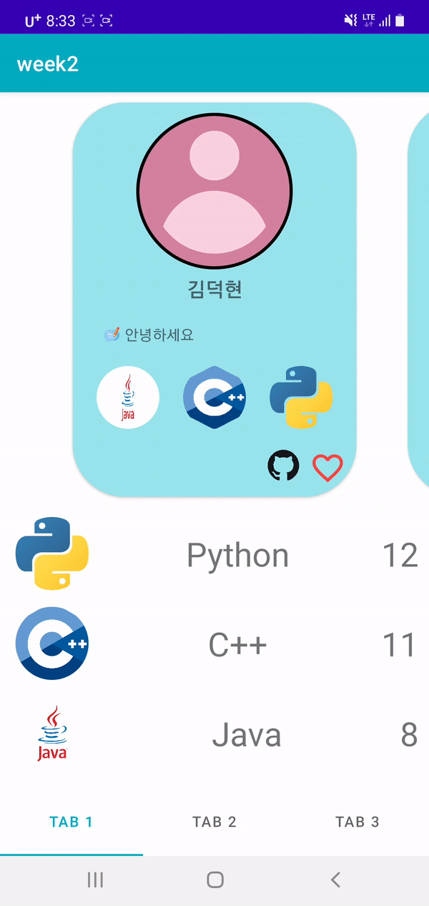

# CS496_week2

### 제목: 

---

### 팀원 : 김덕현(FE), 권효재(BE) 

---

### 몰입캠프 3,4 주 팀 매칭에 사용할 앱 개발 

---


### 로그인

---

**개인 정보 입력**

1. 자신의 기술스택, 사용언어, 직군, 깃허브주소, 한줄소개를 서버로 전달
2. kakao login sdk사용
 

### Tab 1

---

**우리 분반 기술 확인**

1. 누가 어떤 기술 스택을 갖고 있는지 볼 수 있음.
2. 언어 별 사용자 수를 알 수 있다. => 언어를 클릭하면 그 언어를 사용하는 사람들만 볼 수 있음
3. 하트를 눌러 같이하자고 시그널을 보낼 수 있음 
4. 클릭을 통해 상세 정보를 볼 수 있음.

 

 

### Tab 2

---

**아이디어 별 팀매칭**

1. 자신이 갖고 있는 아이디어를 올릴 수 있음
2. 아이디어에 사용할 기술 스택과 아이디어에 대한 설명을 적을 수 있음.
3. 만약 아이디어가 마음에 든다면, 같이하자고 시그널을 보낼 수 있음
4. 같이하자고 시그널 보낸 사람들을 알 수 있음


### Tab 3

---

**개인 별 추천 팀매칭**

1. 자신이 입력한 기술 스택과 직군에 맞춰서 팀하면 좋은 사람들을 알고리즘에 따라 보여줌
2. 좋은 사람들을 색상에 따라 나눠 보여줌


 


### API 목록 :

### 로그인

**주소**

```json
<http://192.249.18.118/login/>
```

**param**

1. Uid → 유저 아이디/ 코드에서 받아오기
2. Upw →  유저 비번/ 임의 설정 가능
3. Uname →  유저/이름
4. Usay → 유저/한줄소개
5. Utype → 유저/ 기술 직군 1.FE // [2.BE](http://2.BE) //  3.FS
6. github → 깃허브 뒤에 아이디
7. lang1 → 첫번쨰로 잘하는 언어
8. lang2 → 두번쨰로 잘하는 언어
9. lang3 → 세번쨰로 잘하는 언어

### Tab1

1. 전체 사용자 불러오는 api(get)

**주소**

```python
<http://192.249.18.118/user/>
```

**result**

```json
[
		{
    "Uid": "exampl111@naver.com",
    "Uname": "exampleName",
    "Usay": "let's do it well",
    "Utype": 1,
    "github": "example",
    "Llang1": "Java",
    "Llang2": "Python",
    "Llang3": "exc"
  },
  {
    "Uid": "exampl111@naver.com",
    "Uname": "exampleName",
    "Usay": "let's do it well",
    "Utype": 1,
    "github": "example",
    "Llang1": "Java",
    "Llang2": "Python",
    "Llang3": "exc"
  },
  {
    "Uid": "exampl111@naver.com",
    "Uname": "exampleName",
    "Usay": "let's do it well",
    "Utype": 1,
    "github": "example",
    "Llang1": "Java",
    "Llang2": "Python",
    "Llang3": "exc"
  }
]
```

1. 특정 사용자 detail 불러오는 api(get)

param → 사용자 id

**주소**

```python
<http://192.249.18.118/user/khj010909>
#이때 khj010909는 사용자의 id이다. 
#즉, 사용자의 id를 가장 마지막에 넣어 url을 만들면 된다. 
```

**result**

```json
[
  {
    "Uid": "khj010909",
    "Upw": "1111",
    "Uname": "Hyojae",
    "Usay": "Hi",
    "Utype": 1,
    "Uideaid": 1,
    "Ustack": "Android studio",
    "github": "hyojaeKwon",
    "Lid": "khj010909",
    "Llang1": "Kotlin",
    "Llang2": "Java",
    "Llang3": "C++"
  }
]
```

1. 같이하기 요청 api(post)

//추가예정

### Tab2

1. idea 게시글 불러오는 api(get)

   **주소**

   ```python
   <http://192.249.18.118/ideas/>
   ```

   **result**

   ```json
   [
     { //Iid는 게시글 id
       "Iid": 61,
       "Ititle": "게시글 제목",
       "Idescription": "게시글 설명",
       "IauthorId": "khj010909"
     },
     {
       "Iid": 60,
       "Ititle": "게시글 제목",
       "Idescription": "게시글 설명",
       "IauthorId": "khj010909"
     },
     {
       "Iid": 59,
       "Ititle": "게시글 제목",
       "Idescription": "게시글 설명",
       "IauthorId": "khj010909"
     }
   ]
   ```

2. idea detail 불러오는 api(get)

   param → 게시글 id

   **주소**

   ```python
   <http://192.249.18.118/ideas/2>
   # 맨 마지막 2는 게시글 아이디입니다.
   ```

   **result**

   ```json
   [
     [
       {
         "Iid": 2,
         "Ititle": "아이디어 재미져2",
         "Idescription": "아이디어 설명2",
         "IauthorId": "khj01090909"
       }
     ],
     [
       {
         "PUid": null
       },
       {
         "PUid": "khj010909"
       },
       {
         "PUid": "khj010909"
       },
       {
         "PUid": "khj010909"
       }
     ],
   	[
       {
         "ISid": 45,
         "IStack": "Java"
       },
       {
         "ISid": 45,
         "IStack": "Python"
       }
     ]
   ]
   ```

3. idea 게시글 등록 api (post)

   param →

   1. key : title → value : “게시글 제목”
   2. key : description → value : “게시글 설명”
   3. key : id→ value : “게시자 id”
   4. key : frontEnd→ value : “사용할 프론트 기술스택”
   5. key : backEnd→ value : “사용할 백 기술스택”
   6. key : etc → value :기타 기술스택

   **주소**

   ```python
   <http://192.249.18.118/ideas/create>
   ```

4. 같이할 사람 신청 api(post)

   param →

   1. key: Iid → value : “게시글 id”
   2. key: participant → value : “같이하자고 신청한 사람 id”

   **주소**

   ```python
   <http://192.249.18.118/ideas/participant>
   ```

### Tab 3

1. 팀원 매칭 api (get)

```json
<http://192.249.18.118/match/khj010909>
#뒤는 user id 입력하는 곳
[
  {
    "Uid": "exampl111@naver.com",
    "Uname": "exampleName",
    "Usay": "let's do it well",
    "Utype": 1,
    "github": "example",
    "Llang1": "Java",
    "Llang2": "Python",
    "Llang3": "exc"
  },
  {
    "Uid": "exampl11@naver.com",
    "Uname": "exampleName",
    "Usay": "let's do it well",
    "Utype": 1,
    "github": "example",
    "Llang1": "Java",
    "Llang2": "Python",
    "Llang3": "exc"
  },
  {
    "Uid": "exampl1@naver.com",
    "Uname": "exampleName",
    "Usay": "let's do it well",
    "Utype": 1,
    "github": "example",
    "Llang1": "Java",
    "Llang2": "Python",
    "Llang3": "exc"
  },
  {
    "Uid": "exampleD2@naver.com",
    "Uname": "exampleName",
    "Usay": "let's do it well",
    "Utype": 3,
    "github": "example",
    "Llang1": "Java",
    "Llang2": "Python",
    "Llang3": "exc"
  },
  {
    "Uid": "exampleD@naver.com",
    "Uname": "exampleName",
    "Usay": "let's do it well",
    "Utype": 3,
    "github": "example",
    "Llang1": "Java",
    "Llang2": "Python",
    "Llang3": "exc"
  },
  {
    "Uid": "exampleID@naver.com",
    "Uname": "exampleName",
    "Usay": "let's do it well",
    "Utype": 2,
    "github": "example",
    "Llang1": "Java",
    "Llang2": "Python",
    "Llang3": "exc"
  },
  {
    "Uid": "khj010909",
    "Uname": "Hyojae",
    "Usay": "Hi",
    "Utype": 1,
    "github": "hyojaeKwon",
    "Llang1": "Kotlin",
    "Llang2": "Java",
    "Llang3": "C++"
  },
  {
    "Uid": "khj01090909",
    "Uname": "Hyo",
    "Usay": "Hi",
    "Utype": 1,
    "github": "hyojaeKwon",
    "Llang1": "C",
    "Llang2": "Python",
    "Llang3": "C++"
  }
]
```

## 같이 하자고 한 팀원 api(get)

**주소**

```json
<http://192.249.18.118/who-pick/khj010909> #맨 마지막은 id 입력
```

**result**

```json
[
  {
    "PFromid": "example@naver.com"
  },
  {
    "PFromid": "example@naver.com"
  }
]
```

팀원 신청 api (post)

**주소**

```json
<http://192.249.18.118/pick/>
```

param →

1. key: fromId→ value : “같이 하자고 신청한 사람 id”
2. key: toId→ value : “같이할 사람 id”


## 다 만들지 못한 이유 분석

1. 다들 처음 만들어 봤다. 

   김덕현은 1주차때 자신이 맡지 않았던 부분을 코딩했고, 권효재는 처음 서버와 디비를 다뤘다.

2. 타이트한 일정관리

   개발 일정을 타이트하게 짰다. 서버와 클라이언트 연결을 너무 늦게 시작하다 보니 다 마무리하지 못했다.

3. 활발한 소통의 부재

   소통을 하는데 있어 약간의 불협화음 존재 : api들이 많다 보니 문서화를 하지 않았을때, 클라이언트가 바라는 api의 형식과 서버가 제공하는 api형식이 다른 경우가 많았다.

4. 느린 서버 제작

   서버를 제작을 너무 늦게 완료하여 클라이언트가 api를 적용할 시간이 부족했다. 


## 다음주에는 꼭 다 만들자~
